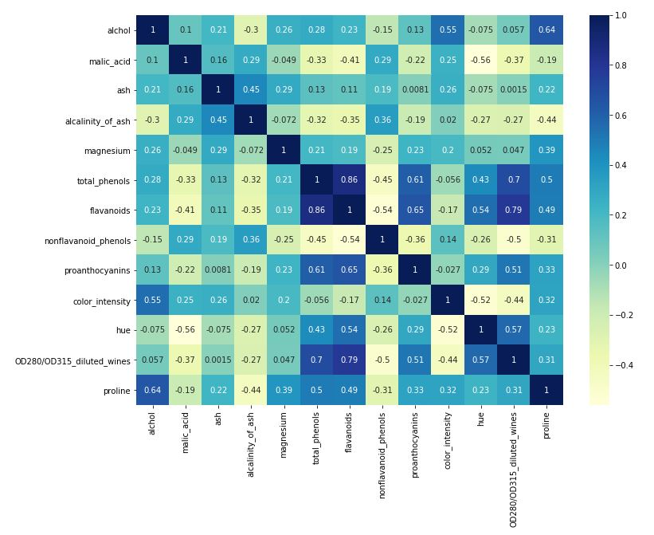
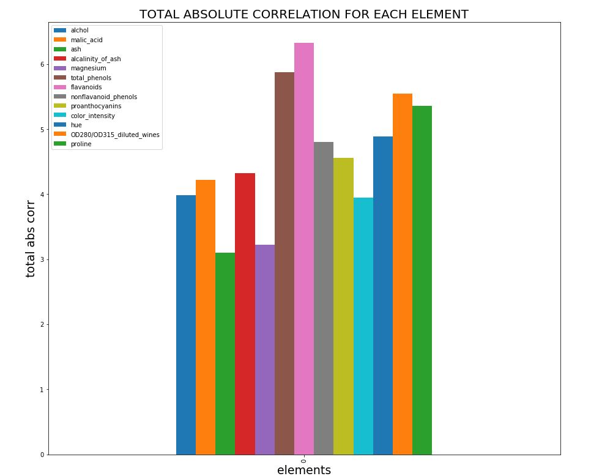
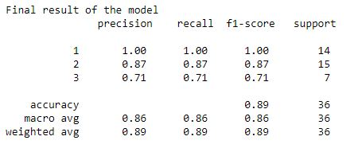

# Predicting the vaieties of Italian wines with KNN

## Introduction
The aim of this project is to understand KNN by creating a model that is able to predict the varieties of wines.
The dataset is the result of a chemical analysis of wines grown in the same region in Italy but derived from three different cultivars organized in three classes. 
The analysis was done by considering the quantities of 13 constituents found in each of the three types of wines.

The data set comes from [Kaggle](https://www.kaggle.com/). For additional information you can read my article on Towards Data Science (here.)[https://towardsdatascience.com/machine-learning-observe-how-knn-works-by-predicting-the-varieties-of-italian-wines-a64960bb2dae?source=friends_link&sk=35c7b1380bfb8e9911ad45041bd44b57] 

## Labels
- Class 1 
- Class 2 
- Class 3 

## Features
- Alcohol
- Malic acid
- Ash
- Alcalinity of ash
- Magnesium
- Total phenols
- Flavanoids
- Nonflavanoid phenols
- Proanthocyanins
- Color intensity
- Hue
- OD280/OD315 of diluted wines
- Proline

## Usage
```python
import sklearn
from sklearn import preprocessing
from sklearn.model_selection import train_test_split
import pandas as pd
import matplotlib.pyplot as plt
import seaborn as sns
import numpy as np
```
## Data Visualization before processing




## Model performance


## License
The dateset for this project comes from [Kaggle](https://www.kaggle.com/) website.
